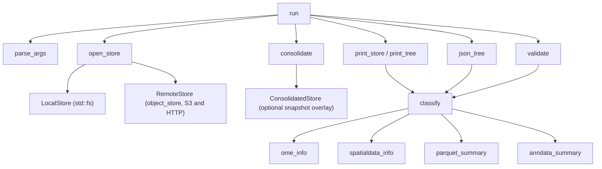
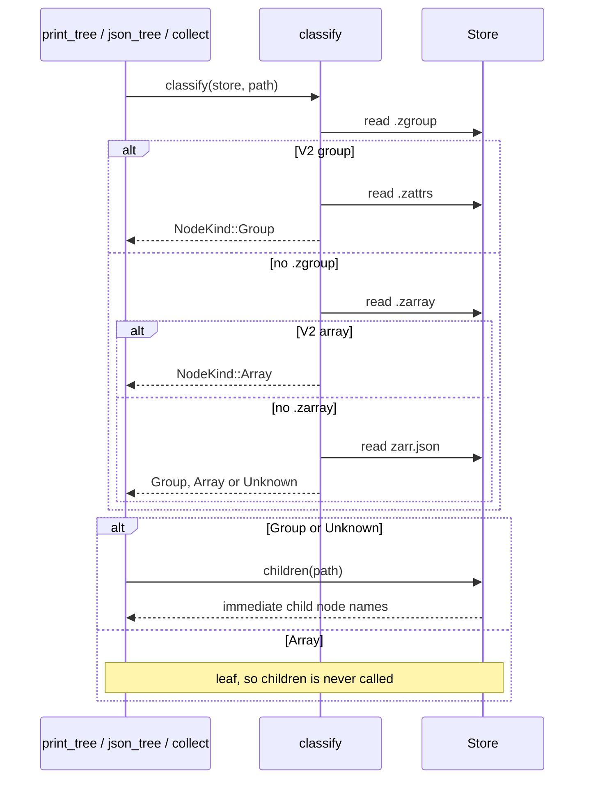
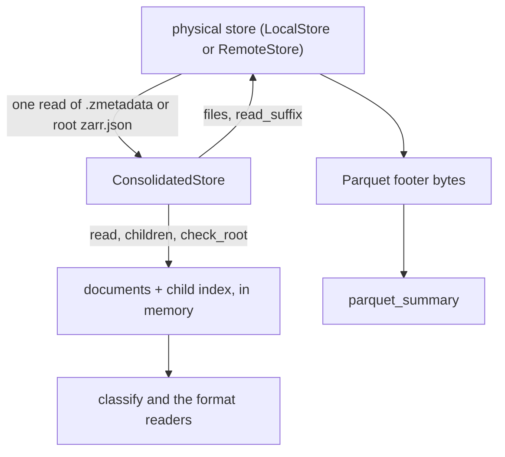
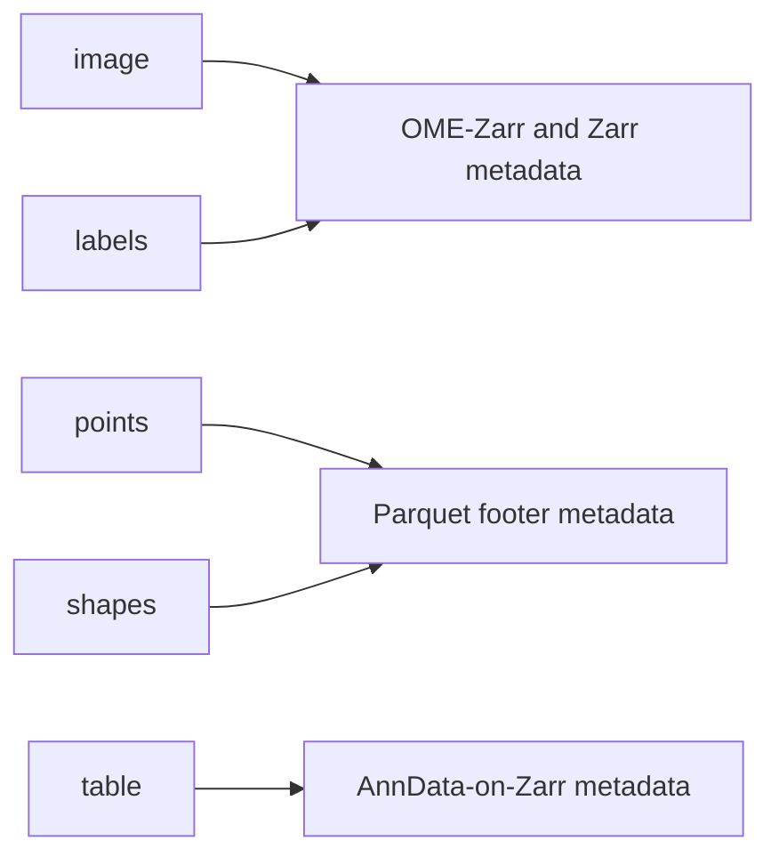

# Architecture

This document describes how `zarr-tree` is put together: where storage access
ends and metadata interpretation begins, why a local directory, an S3 prefix
and an HTTP path are walked by the same code, and why an array is where the
walk stops.

It describes the implementation as it stands on `master` (post-v0.3.0, with
`--validate`). Everything named here — every type, function and constant — is
in `src/main.rs`, which holds the whole program. There are no modules; the
[source map](#source-map) at the end is how to navigate it.

For what the tool supports today see [Project status](status.md); for how to
run it see [Getting started](getting-started.md).

## Design principles

**Read-only.** Nothing is opened for writing, anywhere, in any backend. A store
is an input.

**Metadata first.** `zarr-tree` reads the small JSON documents that describe a
store — `.zgroup`, `.zarray`, `.zattrs`, `zarr.json` — and the footers of the
Parquet files a SpatialData element declares. It reads no chunk, no pixel, no
Parquet record and no expression value. Everything printed is something a store
*declares* about itself.

**Storage-neutral semantic interpretation.** One trait, `Store`, answers where
bytes come from. Above it, the walk, both renderers, the validator and every
reader of Zarr, OME-Zarr, SpatialData, Parquet and AnnData metadata are written
once and never learn which kind of store answered. Local, S3 and HTTP produce
the same tree because they run the same code over the same JSON.

**Arrays are traversal leaves.** An array's children are its chunk objects, and
a real store has millions of them. `print_tree`, `json_tree` and the validation
walk all stop at `NodeKind::Array` and print its metadata instead of
descending. No listing is ever made below an array, so the cost of a walk is
proportional to the number of nodes, not to the size of the data.

**Graceful degradation.** `Store::read` returns `Option<String>` and does not
distinguish "missing" from "unreadable", because no caller treats them
differently. `classify` cannot fail: a node whose metadata cannot be read or
understood is `NodeKind::Unknown` and the walk continues. Individual fields
fall out on their own — an unreadable `chunks` prints `?` and leaves `shape`
alone. See [Error and degradation model](#error-and-degradation-model).

**Consolidated metadata is a snapshot.** When a store carries a consolidated
metadata document, `ConsolidatedStore` serves the whole Zarr hierarchy from it
and the physical store is not consulted for Zarr metadata again. The overlay is
all-or-nothing on purpose: a tree that mixed a snapshot with live reads would
show two moments at once and label neither.

**Validation reuses inspection metadata.** `--validate` opens, consolidates and
classifies the store exactly as a tree does, walks the same nodes through the
same `child_dirs`, and then asks questions of what it found. It is a second
pass over one walk, not a second reader of the store.

**Scientific payloads are not loaded.** The two payload formats that appear in
a SpatialData store are read at their cheapest possible point: a Parquet file
through its footer alone, an AnnData table through the Zarr metadata of five
nodes. Neither reads a value, and neither counts anything.

## System overview



`run` opens a store, offers it to `consolidate`, classifies the root, checks
that the root is really there, and then hands the store to exactly one of three
consumers. All three reach the store only through the `Store` trait, and all
three classify nodes with `classify`.

The format readers hang off `classify` because that is where they are called
from: a node's metadata is read once and the readers are handed the parsed
value. `parquet_summary` and `anndata_summary` sit there for the same reason,
but they reach the store on their own — `parquet_summary` through
`Store::files` and `Store::read_suffix`, `anndata_summary` through
`Store::read` — and only when the group's own metadata has already said it is
a SpatialData points, shapes or table element.

## The Store trait

`Store` answers five questions. Three of them are what a Zarr walk asks; the
other two exist for binary payloads and are used by nothing else.

| Method | Purpose |
| --- | --- |
| `read(&self, path: &str) -> Option<String>` | The text of one metadata file. `None` for missing or unreadable — the two are deliberately not told apart. |
| `children(&self, path: &str) -> io::Result<Vec<String>>` | The immediate child *nodes* of a node, sorted. Directories locally, common prefixes remotely. Never a file, so never a chunk. |
| `check_root(&self, identified: bool) -> io::Result<()>` | Fail before anything is printed if the store root is not there. `identified` says whether the root's own metadata already proved it exists. |
| `files(&self, path: &str) -> io::Result<Vec<String>>` | The files directly inside a path, sorted — the half `children` throws away. One caller: `payload_files`, listing the parts of a points payload. |
| `read_suffix(&self, path: &str, len: u64) -> Option<Vec<u8>>` | The last `len` bytes of an object. The only method that reads something other than metadata. |

Paths are `/`-separated and relative to the store root, with the empty string
for the root itself; `child_path` joins them. Each implementation adds its own
base — a directory here, a bucket and key prefix there — which is what keeps
that base out of everything above.

`read_suffix` is shaped as a safeguard rather than a convenience. Parquet keeps
its metadata at the end of a file, so the end is all anybody needs, and a
method that can *only* ask for the end cannot be talked into fetching a
multi-gigabyte transcripts payload however wrong its caller is about the file's
size.

`check_root` takes an argument for one reason. A local store ignores it —
`exists()` answers for nothing. A remote store has no cheap existence check and
must fall back on a listing, and the one listing it must never make is of an
array's prefix. Metadata that already identified the root is proof enough that
it exists, so the listing is reached only when nothing identified it, which is
exactly when the prefix cannot be an array.

### Implementations

| Type | Backing | Notes |
| --- | --- | --- |
| `LocalStore` | `std::fs` | `read_to_string`, `read_dir` split into directories (`children`) and files (`files`), `File::seek` for `read_suffix`. |
| `RemoteStore` | `object_store` | One `Backend`, `S3` or `Http`. `list_with_delimiter` answers `children` from its common prefixes and `files` from its objects — the same request, two halves. `read_suffix` is a `head` for the size, then a bounded `GetRange`. |
| `ConsolidatedStore` | a document plus the store it came off | See [Consolidated metadata](#consolidated-metadata). |

`RemoteStore::s3` builds an `AmazonS3Builder` from the `AWS_*` environment
variables; `RemoteStore::http` builds an `HttpBuilder` over the URL's origin.
Both are driven on a current-thread Tokio runtime held by the store, because
`object_store` is async throughout and nothing else here is. The unit tests
build a third `RemoteStore` over `object_store`'s in-memory store, which is
what lets remote behaviour be tested with no network and no AWS account.

The operational side of all this — credentials, endpoints, WebDAV, what a
static server can and cannot do — is in
[Remote stores](remote-stores.md).

## Walking the store

Deciding what kind of node sits at a path takes at most three reads, in a fixed
order: Zarr V2's `.zgroup`, then V2's `.zarray`, then V3's `zarr.json`. V2 is
checked first, so a directory carrying both layouts is reported as V2. A V2
group costs one further read, `.zattrs`, which is where V2 keeps user
attributes; V3 carries them inside `zarr.json` and needs no second file.



The last branch is the important one. An array is a leaf in all three
consumers: `print_tree` prints its `ArrayMeta` rows instead of recursing,
`json_tree` gives it an empty `children` array, and `collect` records it and
stops. `Store::children` is never called on an array's path, and `children` is
the only place a listing is made at all — so an array's chunk objects are never
enumerated, however many there are. That is what makes a store affordable to
walk remotely: cost tracks the number of nodes, not the number of chunks.

Both renderers and the validator get their children from one function,
`child_dirs`, which is what keeps them agreeing about which children exist and
in what order. It also enforces `--depth`: `Some(0)` returns an empty list
without asking the store at all, which remotely is one request saved per node.
It has one further special case — a SpatialData points element's
`points.parquet/` directory is dropped, because it is a payload rather than a
Zarr node and would otherwise print as `[unknown]` directly above the rows
summarising it.

A group's classification also triggers the two payload readers,
`parquet_summary` and `anndata_summary`, but only after `spatialdata_info` has
already said the group is a points, shapes or table element. Both are described
below.

## Consolidated metadata

Some stores keep a copy of every metadata document in the tree in one object at
the root. `zarr-tree` reads the two forms current zarr-python writes:

| Zarr version | Where | Accepted when |
| --- | --- | --- |
| V2 | `.zmetadata` at the root | `zarr_consolidated_format` is `1` |
| V3 | a `consolidated_metadata` block in the root `zarr.json` | `kind` is `inline` and `must_understand` is `false` |

`consolidate` tries `consolidated_v2`, then `consolidated_v3`. Either builds a
`BTreeMap` from metadata path to document text, keyed exactly as `Store::read`
takes it — `.zgroup`, `images/0/.zarray`, `a/b/zarr.json` — and `child_index`
derives the parent-to-children map from those paths alone. When neither
document is found, or one is found in a form that is not read, `consolidate`
hands back the store it was given, unchanged. Consolidation is opportunistic:
no store that worked without it may come to depend on it.

For a plain static HTTP server this is the difference between a root and a
tree. Such a server answers `GET` but not the WebDAV `PROPFIND` a listing
needs, so without consolidation the walk cannot get past the root; with it, no
listing is wanted, because the children are in the document.



The split in that diagram is the whole design. `read`, `children` and
`check_root` answer from the index and from nothing else: a metadata file the
document does not name is missing as far as this store is concerned, and there
is no fallback in either direction. `check_root` is trivially `Ok(())` —
the document was read off the store, so the root is there, which is the check a
server without a listing could not otherwise have passed.

`files` and `read_suffix` are forwarded to the physical store, because no
consolidated document has ever carried a Parquet footer. A SpatialData shapes
element therefore still summarises on a consolidated static HTTP store, since
its payload is a single file at a known path; a points element on that same
server still cannot, because enumerating its parts needs a listing the server
will not answer. That is reported as `parquet files: ?`, not as an element with
no payload.

## Metadata classification

`classify` returns one of three things:

| `NodeKind` | Carries | Printed as |
| --- | --- | --- |
| `Group(GroupMeta)` | `ome`, `spatialdata`, `parquet`, `anndata` | `[group]`, with tags appended |
| `Array(ArrayMeta)` | `shape`, `chunks`, `shards`, `dtype` | `[array]` |
| `Unknown` | nothing | `[unknown]` |

The higher-level formats are annotations on Zarr structure, not structures of
their own. A SpatialData image *is* a Zarr group; being an OME-Zarr multiscale
and a SpatialData element are two independent facts read by two readers that
know nothing about each other, and `NodeKind::label` simply collects whatever
tags the group earned:

```
[group, OME-Zarr 0.5]
[group, SpatialData points]
[group, OME-Zarr 0.5-dev-spatialdata, SpatialData image]
```

`ArrayMeta` keeps dimensions as the JSON values the file held rather than as
finished text, because the tree wants `[4096, 4096]` and `--json` wants a real
array. Nothing interprets the entries, so a malformed `"shape": [1, "x"]`
survives to the output instead of being dropped on the way. `shards` is the one
field that is *absent* rather than unread when it is `None`: only a V3 array
using the sharding codec has shards at all.

Recognition is always from metadata markers, never from a name. A group is an
OME-Zarr image because its attributes carry `multiscales`, a plate because they
carry `plate`, a SpatialData store root because they carry
`spatialdata_attrs.spatialdata_software_version`. A directory called `points`
is a directory called `points`.

## OME-Zarr

OME-Zarr interpretation is metadata enrichment on an ordinary Zarr group.
`ome_info_v2` reads the keys from the top level of `.zattrs`; `ome_info_v3`
reads them from the `ome` namespace inside `zarr.json`; both then hand the same
object to `ome_info`, which decides between three kinds:

| `OmeKind` | Marker | Read from it |
| --- | --- | --- |
| `Image` | a non-empty `multiscales` array | axis names and dataset paths from the first entry |
| `Plate` | a `plate` object | declared row and column counts, and the well paths |
| `Well` | a `well` object | nothing beyond the tag |

The version is kept exactly as stored and never checked against the versions
this tool happens to know about. `axes` handles both the 0.3 list-of-names and
the 0.4/0.5 list-of-objects forms; `datasets` has not changed shape since 0.1
and needs no per-version handling.

`image-label` is read for its presence alone, and only as the thing that tells
a SpatialData `labels` element from an `image` — nothing inside it is
displayed. Coordinate transformations, `omero` blocks, channel metadata,
acquisitions and fields of view are not read; see
[Project status](status.md#ome-zarr).

## SpatialData

`spatialdata_info` tries three markers in turn and yields at most one
`SpatialData` value:

| Variant | Recognised by |
| --- | --- |
| `Root(version)` | `spatialdata_attrs.spatialdata_software_version` — only a store root records it |
| `Points`, `Shapes`, `Table` | `encoding-type` or `spatialdata-encoding-type` matching `ngff:points`, `ngff:shapes`, `ngff:regions_table` exactly |
| `Image`, `Labels` | `spatialdata_attrs` *plus* OME-Zarr `multiscales`; the presence of `image-label` makes it `Labels` |

The architectural point is that the five element kinds do not reach their
content the same way:



Images and labels are entirely described by metadata the Zarr and OME-Zarr
readers already handle. Points and shapes carry their coordinates and
geometries *outside* the Zarr hierarchy, in Parquet files. A table carries its
annotations in an AnnData object written into Zarr. The last two are the only
places this program reads anything that is not a Zarr metadata document, and
each is described below.

A table also declares what it annotates — `region`, `region_key`,
`instance_key` — which `table_annotation` reads from the same attributes
object. Those are *names* of elements and of `obs` columns; no column value is
read to reconstruct any of it.

The [SpatialData reference](spatialdata.md) documents what each of these
readers reports, and what it deliberately does not.

## The Parquet path

`zarr-tree` reads Parquet footers and nothing else. No row group, no page, no
column chunk and no value is touched.

Reaching a payload takes four steps, and the first is the safeguard:

1. **The element identifies itself.** `parquet_summary` returns
   `Payload::Absent` immediately unless `spatialdata_info` already said this
   group is a points or shapes element. A `.parquet` file elsewhere in a store
   is not a payload and is never opened.
2. **The convention supplies the path.** No element declares where its payload
   is, so `payload_files` hard-codes SpatialData's writer conventions: a shapes
   payload is the single file `shapes.parquet`; a points payload is the
   directory `points.parquet/` of `part.N.parquet` parts, which needs
   `Store::files` to enumerate. That listing is the reason a points element can
   be inspected on S3 and on WebDAV but not on a plain static HTTP server.
3. **The footer is read.** `parquet_metadata` asks `read_suffix` for the last
   `PARQUET_TAIL` bytes — 64 KiB — which holds the eight-byte tail and, nearly
   always, the metadata block above it. A schema
   too large for that costs exactly one more read, of the length the tail just
   named. Two reads at worst, of a few kilobytes, whether the file is three
   kilobytes or two gigabytes.
4. **The parts are summed.** `num_rows` from every part's footer, the schema
   from the first part's alone — the parts of one payload are one table written
   in pieces.

This is a separate access path from ordinary metadata. Zarr metadata comes
through `Store::read`, which returns whole documents as text. Payload metadata
comes through `Store::files` and `Store::read_suffix`, which return names and
bounded byte ranges. The `Payload` enum keeps the three outcomes apart —
`Absent`, `Unavailable`, `Summary` — because "there is nothing there" and
"there is something there and it could not be read" are different facts, and
a points element on a listing-less server is the second.

## The AnnData path

A SpatialData table holds an AnnData object written into Zarr.
`anndata_summary` interprets that object's *Zarr metadata*. It does not depend
on `anndata`, on `zarrs`, or on anything beyond `serde_json` and the `Store`
trait already in use.

AnnData records the shape of a table in metadata, so nothing has to be counted:

| Reported | Read from |
| --- | --- |
| observations | the length declared by the `shape` of the array `obs`'s `_index` names, falling back to `X`'s first dimension |
| variables | the same for `var`, falling back to `X`'s second dimension |
| `X` representation | `X` being a Zarr array means dense; a group whose `encoding-type` is `csr_matrix` or `csc_matrix` is that |
| `X` shape and dtype | `X`'s own array metadata, or the `shape` in a sparse group's attributes |
| `obs` / `var` columns | each dataframe's declared `column-order`, never the children on disk |
| region linkage | `region`, `region_key`, `instance_key` in the table group's attributes |

That is five metadata reads below the table node — `obs`, `var`, each index
array, and `X` — and no listing at all. Every path is named by a metadata file,
so the summary costs the same handful of reads on a static HTTP server as on a
local disk, and comes wholly out of a consolidated snapshot when there is one.

Not read, for these summaries: a sparse matrix's `data`, `indices` or `indptr`
arrays; any chunk of `X`; any `obs` or `var` value; any category or code of a
categorical column; `uns`, `layers`, `obsm`, `obsp`, `varm`, `varp` or `raw`.
Nothing is counted, and no non-zero count is reported, because finding one
would mean reading `indptr`.

## Validation

`--validate` prints findings instead of a tree. Everything above the branch in
`run` is identical: the store is opened, offered to `consolidate`, and the root
is classified and checked exactly as it is for a tree.

It runs in two passes.

**Pass 1 — `collect`.** Walk the store recursively from the root, classify
every node, and keep the results in a `BTreeMap<String, NodeKind>` keyed by
store path. Children come from `child_dirs` with no depth limit, so the
validator sees exactly the nodes a tree would print, minus nothing and plus
nothing. Arrays are leaves here as everywhere else.

**Pass 2 — `check_node` over the map.** With every node in hand, the checks run
in path order and can resolve one node against another.

The second pass exists because one rule crosses nodes: a table's `region` names
a SpatialData element that may sit anywhere in the store, quite possibly ahead
of the table in the walk. No single streaming pass could answer that in every
traversal order, and a rule whose result depended on traversal order would not
be a rule. The same map answers the OME dataset and plate well rules, which
resolve declared paths without opening anything.

`BTreeMap` rather than `HashMap` gives the second pass path order, so the same
store produces the same report in the same order every time.
`spatialdata_elements` is gathered once from the map before the checks, since
every table asks it the same question.

There is no rule type, no registry and no engine. A finding is a
`ValidationFinding` — severity, path, message — and a run is a
`Vec<ValidationFinding>`. `--validate` is refused together with `--depth`,
because a partial walk would report every node below the limit as missing.

### The seven rules

| Check | Metadata used | Severity when broken |
| --- | --- | --- |
| A node's metadata is readable, and an array's `shape`, `chunks` and `shards` agree on dimensionality | the node's own `.zgroup` / `.zarray` / `zarr.json` | `ERROR` for an unreadable root or a dimensionality disagreement; `WARN` for an unreadable node below the root, or unreadable chunks |
| Every OME `datasets[].path` exists and is an array | `multiscales[0].datasets`, resolved against the node map | `ERROR` |
| Pyramid levels agree on dimensionality | the levels' own `shape`, against `multiscales[0].axes` where declared, else against the first level | `ERROR` |
| Every path in a plate's `wells` exists and is a group | `plate.wells`, resolved against the node map | `ERROR` |
| A table's `region` names an existing SpatialData element | the table's `region`, against the element names the walk found | `ERROR` |
| An AnnData `X` matches the `obs` and `var` index lengths | `X`'s shape, and each index array's declared `shape` | `ERROR` |
| A points or shapes Parquet payload is readable | the payload footers, via `files` and `read_suffix` | `WARN` — an unreadable payload is not a broken store, and an absent one is not a finding at all |

`WARN` means "could not be checked", never "broken". That distinction is why a
payload on a listing-less server warns rather than errors, and why the exit
status is built from errors alone.

The AnnData rule re-reads the two index lengths through `dataframe` rather than
taking them from the `AnnData` the tree prints. The displayed value falls back
to `X`'s own shape when an index cannot be read, which is the right thing to
show and a useless thing to check: comparing `X` against a number taken from
`X` would pass whatever the store held.

### Exit status

| Status | Meaning |
| --- | --- |
| `0` | the store was walked; with `--validate`, nothing worse than a `WARN` |
| `1` | the store could not be read, or the command line made no sense |
| `2` | `--validate` completed and reported at least one `ERROR` |

`exit_status` inspects the findings; `run` returns the status as a value so
that output is written and flushed before the process ends. Usage is in
[Getting started](getting-started.md).

## Error and degradation model

Three different regimes, deliberately:

**Inspection degrades.** `Store::read` returns `Option`, and absence and
failure are not told apart because no caller treats them differently.
`classify` cannot fail — an unreadable or unrecognised node becomes
`NodeKind::Unknown` and the walk goes on. Below that, each field falls out on
its own: a readable `shape` beside an unreadable `chunks` prints the shape and
a `?`. That is why so many parser functions return `Option` rather than
`Result`; there is nothing a caller could do with the reason, and a broken
`zarr.json` in one corner of a store must not end the walk.

In the tree an unreadable field is `?`; in `--json` it is `null`. The
exceptions are `shards`, which is omitted entirely when the array is not
sharded (not applicable, rather than unreadable), and `Payload`, whose three
outcomes are distinct on purpose.

**Validation reports.** The same unreadable metadata that costs a tree a `?`
becomes a `WARN` here, and a contradiction between what a store declares and
what it has becomes an `ERROR`. Only an `ERROR` changes the exit status.

**Store failures are fatal.** `children`, `files` and `check_root` return
`io::Result`, and a failure propagates out of the walk to `main`, which prints
one line on stderr and exits 1. A missing root, a denied bucket and a server
that will not answer a listing all end the run — the last with a message saying
precisely that, since telling somebody their store does not exist just after
printing metadata read from it would be plainly wrong. `RemoteStore` keeps a
`reachable` flag purely to make that distinction provable.

One I/O failure is not an error at all. `BrokenPipe` — `zarr-tree store.zarr |
head` — ends the run quietly with exit status 0 and nothing on stderr, which is
the Unix convention for the producing end of a pipeline.

## Current dependency boundary

`zarr-tree` performs its own forgiving metadata interpretation. It does not
depend on [`zarrs`](https://github.com/LDeakin/zarrs), or on any other Zarr
library.

The reason is scope. The current job is metadata inspection: read small JSON
documents, report what they declare, and print `?` rather than failing when one
is malformed. A general array library exists to decode arrays — codecs, chunk
grids, data types — and none of that is currently reached, so the dependency
would buy nothing this program does today. The whole dependency list is
`object_store`, `parquet`, `serde_json`, `tokio` and `url`, and keeping it
short is a stated design rule.

That is a description of the present, not a verdict. `zarrs` integration is
listed under Research on the [roadmap](roadmap.md#research), together with
chunk-aware inspection and selective array reads: if a real array-reading or
chunk-decoding need arrives, that is when the trade would be worth making. No
decision has been taken, and nothing in the current code anticipates one.

## Source map

The whole program is `src/main.rs`, with its unit tests in the `tests` module
at the bottom; `tests/cli.rs` runs the compiled binary against throwaway
fixture stores. Names below are exact.

| Area | Main types and functions |
| --- | --- |
| CLI | `main`, `run`, `done`, `parse_args`, `Request`, `Options`, `HELP`, `USAGE` |
| Storage | `Store`, `LocalStore`, `RemoteStore`, `Backend`, `Location`, `open_store`, `parse_location`, `parse_http_location`, `child_path`, `anonymous_by_default`, `remote_error`, `first_line` |
| Consolidation | `consolidate`, `ConsolidatedStore`, `consolidated_v2`, `consolidated_v3`, `inline_metadata`, `collect_v3`, `metadata_node`, `child_index` |
| Classification | `classify`, `classify_v3`, `NodeKind`, `GroupMeta`, `ArrayMeta`, `array_meta_v2`, `array_meta_v3`, `read_json`, `child_dirs`, `dims`, `format_dims` |
| OME-Zarr | `OmeInfo`, `OmeKind`, `ome_info`, `ome_info_v2`, `ome_info_v3`, `axis_names`, `dataset_paths` |
| SpatialData | `SpatialData`, `TableAnnotation`, `spatialdata_info`, `spatialdata_info_v2`, `spatialdata_info_v3`, `spatialdata_root`, `spatialdata_encoded_element`, `encoded_kind`, `spatialdata_raster_element`, `table_annotation`, `regions`, `text` |
| Parquet | `Payload`, `ParquetSummary`, `ParquetColumn`, `PARQUET_TAIL`, `parquet_summary`, `payload_files`, `parquet_metadata`, `unreadable`, `schema_columns`, `column_type` |
| AnnData | `AnnData`, `XMatrix`, `DataFrame`, `AnnDataNode`, `anndata_summary`, `dataframe`, `x_matrix`, `anndata_node`, `dim` |
| Tree output | `print_store`, `print_tree`, `print_array_meta`, `group_rows`, `ome_rows`, `table_rows`, `anndata_rows`, `parquet_rows`, `capped`, `grouped`, `SHOWN` |
| JSON output | `json_tree`, `json_array_meta`, `json_ome`, `json_spatialdata`, `json_parquet`, `json_anndata` |
| Validation | `validate`, `collect`, `check_node`, `check_array`, `check_ome`, `check_multiscale`, `check_plate`, `check_spatialdata`, `check_anndata`, `spatialdata_elements`, `ValidationFinding`, `Severity`, `finding`, `counts`, `exit_status`, `print_validation`, `json_validation`, `plural` |

## Changing the implementation

Five things to preserve when touching metadata interpretation:

1. **Local and remote parity.** Nothing above the `Store` trait may learn which
   backend answered. A change that reads differently on S3 than on disk belongs
   inside a `Store` implementation or nowhere.
2. **Arrays as leaves.** No new code path may list below a `NodeKind::Array`.
   This is what keeps a remote walk affordable, and it holds in `print_tree`,
   `json_tree` and `collect` alike.
3. **Graceful degradation.** A malformed document should cost its own field or
   its own node, never the walk. Prefer `Option` over a fatal `Result` for
   anything a caller cannot act on.
4. **Both renderers.** The tree and `--json` show the same facts about the same
   nodes. A new field usually means a row in `group_rows` (or its helpers) and
   a key in the matching `json_*` function, plus tests for both.
5. **Remote request behaviour.** Anything touching `Store` should be tested for
   *how many* requests it makes and of what kind — the in-memory `RemoteStore`
   tests exist for exactly that. An extra read per node is an extra HTTP round
   trip per node.

Then run the quality gate:

```sh
cargo fmt
cargo fmt --check
cargo check
cargo clippy --all-targets -- -D warnings
cargo test
cargo +1.88.0 check --locked
```

`cargo fmt --check` formats nothing; it fails if `rustfmt` would have changed
anything, which is what makes formatting a CI condition rather than a habit.

`cargo clippy --all-targets -- -D warnings` is stricter than `cargo check` in
three ways. Clippy adds lints beyond the compiler's own — needless clones,
redundant patterns, idioms with a better standard-library spelling.
`--all-targets` extends the check to the tests as well as the binary. And
`-D warnings` turns every one of those into an error, so nothing accumulates
unnoticed.

`cargo +1.88.0 check --locked` is the MSRV check CI performs: 1.88 is the
minimum supported toolchain, and `--locked` proves the committed `Cargo.lock`
still resolves.

---

← [Remote stores](remote-stores.md) · [Project status](status.md) ·
[Roadmap](roadmap.md)
